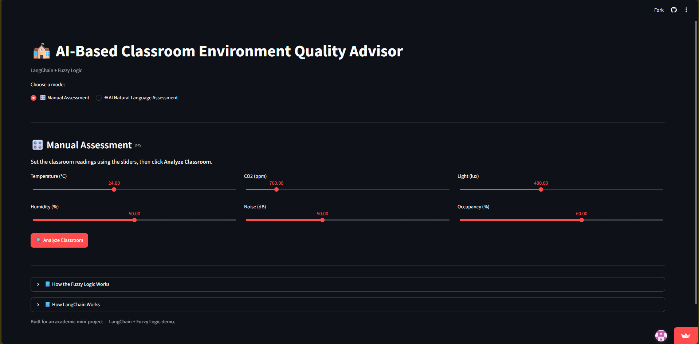
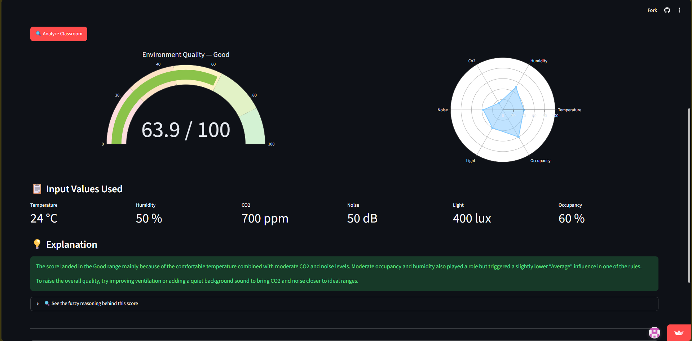
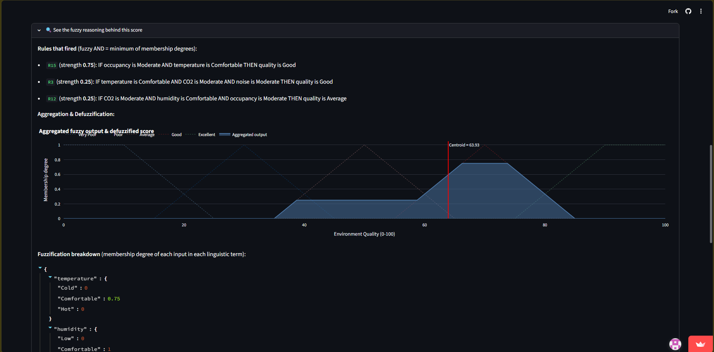
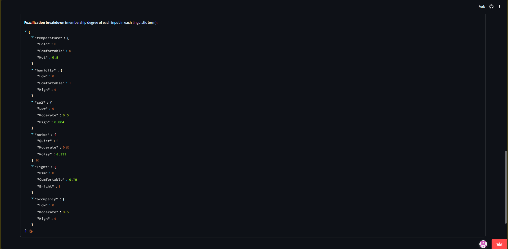
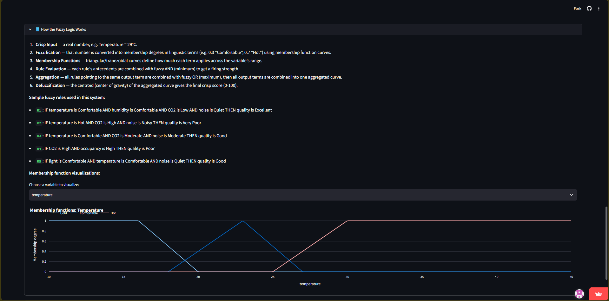
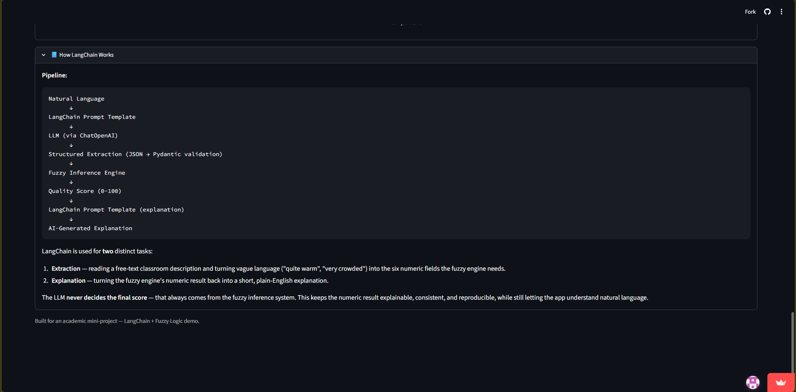
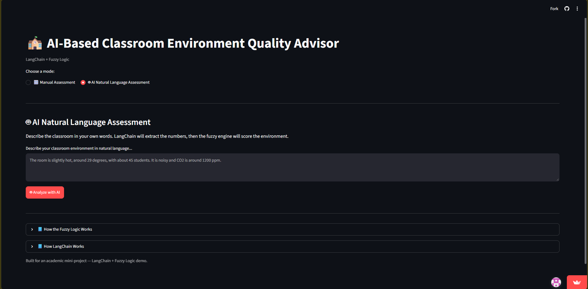
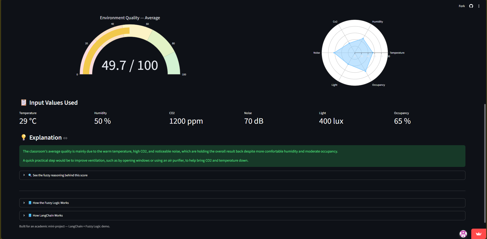
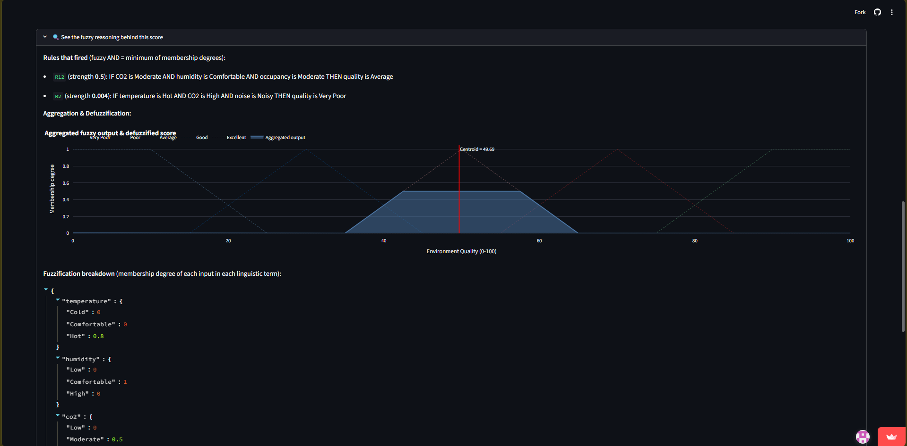
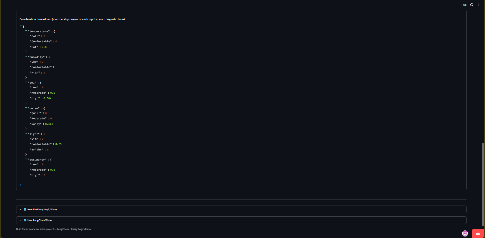

# 🏫 Classroom Environment Quality Advisor

A smart **Classroom Environment Quality Advisor** designed to evaluate classroom environmental conditions and provide useful recommendations for maintaining a comfortable and healthy learning environment.

The project uses a **Fuzzy Inference Engine** to analyze environmental parameters and generate an overall classroom environment assessment. It also includes an **LLM service** for providing intelligent recommendations and natural-language based assessment.

## 🚀 Live Deployment

🔗 **Streamlit App:**
https://classroom-environment-advisor-8wt7gmqzbcj6u3tgzxqcy8.streamlit.app/

---

## ✨ Main Features

* 🌡️ Classroom environmental condition analysis
* 🧠 Fuzzy logic-based environmental assessment
* 📊 Overall classroom environment quality evaluation
* 💡 Intelligent recommendations for improving classroom conditions
* 🤖 LLM-based natural language assessment
* 🔄 LLM error handling and fallback mechanism
* 🎛️ Manual assessment using environmental parameters
* 💬 AI Natural Language Assessment
* 🧪 Unit tests for the fuzzy inference engine
* 🧪 Unit tests for the LLM service
* 🌐 Interactive Streamlit web interface
* ☁️ Online deployment using Streamlit

---

## 🛠️ Technologies / Tech Stack

* **Python**
* **Streamlit**
* **Fuzzy Logic / Fuzzy Inference**
* **LLM Service**
* **Python Unit Testing**
* **Git & GitHub**
* **Streamlit Cloud**

---

## 📁 Project Structure

```text
Classroom-Environment-Quality-Advisor/
│
├── app.py
├── fuzzy_engine.py
├── llm_service.py
├── models.py
├── prompts.py
├── utils.py
│
├── test_fuzzy_engine.py
├── test_llm_service.py
│
├── requirements.txt
├── .env.example
├── .gitignore
├── README.md
│
└── screenshots/
```

### Test Files

**`test_fuzzy_engine.py`**
Contains unit tests for the fuzzy inference engine and environmental quality assessment.

**`test_llm_service.py`**
Contains tests for the LLM service, including error handling and fallback functionality.

---

## ⚙️ Installation and Setup

### 1. Clone the Repository

```bash
git clone <YOUR_GITHUB_REPOSITORY_URL>
```

### 2. Navigate to the Project Directory

```bash
cd Classroom-Environment-Quality-Advisor
```

### 3. Create a Virtual Environment

```bash
python -m venv venv
```

### 4. Activate the Virtual Environment

**Windows:**

```bash
venv\Scripts\activate
```

**Linux / macOS:**

```bash
source venv/bin/activate
```

### 5. Install Dependencies

```bash
pip install -r requirements.txt
```

---

## 🔐 Environment Variables

If the project uses an LLM/API service, configure the required environment variables locally.

Create a `.env` file based on `.env.example`.

Example:

```env
LLM_API_KEY=your_api_key_here
LLM_MODEL=your_model_name
```

> **Important:** Never add actual API keys, passwords, tokens, or other secret values to GitHub.

The `.env` file should be included in `.gitignore`.

For Streamlit Cloud deployment, configure the required secrets through the application's **Secrets** settings.

---

## ▶️ How to Run the Project

After completing the installation and environment setup, start the Streamlit application:

```bash
streamlit run app.py
```

The application will normally be available at:

```text
http://localhost:8501
```

Open the URL in your web browser to use the application.

---

## 🧑‍💻 How to Use the Project

### 🎛️ Manual Assessment

The Manual Assessment mode allows the user to provide classroom environmental parameters manually.

The system processes the entered environmental conditions through the **Fuzzy Inference Engine** and generates an overall classroom environment assessment.

The results can include:

* Environmental quality score
* Overall assessment
* Individual parameter evaluation
* Recommendations for improving classroom conditions

### 🤖 AI Natural Language Assessment

The AI Natural Language Assessment allows the user to describe classroom conditions using natural language.

The **LLM service** processes the description and assists in generating an assessment and recommendations based on the provided information.

The application also includes error handling and fallback functionality when the LLM service is unavailable or encounters an error.

---

## 📸 Screenshots

### 🎛️ Manual Assessment

<p align="center">
  
  
  
  
  
  
</p>

<br>

### 🤖 AI Natural Language Assessment

<p align="center">
  
  
  
  
</p>

---

## 🧠 Fuzzy Inference Engine

The **Fuzzy Inference Engine** evaluates classroom environmental conditions using fuzzy logic.

Instead of relying only on strict numerical thresholds, fuzzy logic allows environmental parameters to be interpreted using linguistic concepts such as different levels of environmental quality.

The fuzzy inference process is used to generate an overall classroom environment assessment from the provided environmental parameters.

---

## 🤖 LLM Service

The project includes an **LLM service** to provide intelligent recommendations and support natural-language based classroom assessment.

The LLM component can process the user's natural-language description and generate useful recommendations based on the identified environmental conditions.

The application also implements **error handling and fallback functionality** to improve reliability when the LLM service is unavailable or an API request fails.

---

## 🧪 Testing

The project includes automated unit tests for important application components.

### Fuzzy Inference Engine Tests

Run:

```bash
python -m pytest test_fuzzy_engine.py
```

### LLM Service Tests

Run:

```bash
python -m pytest test_llm_service.py
```

### Run All Tests

```bash
python -m pytest
```

### Test Coverage Includes

* Fuzzy inference engine functionality
* Environmental assessment logic
* LLM service functionality
* LLM error handling
* Fallback behavior

---

## ☁️ Deployment

The application is deployed using **Streamlit Cloud**.

### Live Application

**Classroom Environment Quality Advisor**

https://classroom-environment-advisor-8wt7gmqzbcj6u3tgzxqcy8.streamlit.app/

---

## 🎯 Project Objective

The objective of this project is to develop a smart classroom environment assessment system that combines **Fuzzy Logic** and **LLM technology** to evaluate environmental conditions and provide useful recommendations.

The system provides both **manual parameter-based assessment** and **AI-powered natural language assessment** through an interactive Streamlit interface.

---

## 👨‍🎓 Student Details

| Field           | Details          |
| --------------- | ---------------- |
| **Name**        | Dhanush Devendra |
| **Roll Number** | 19009            |

---

## 📄 License

This project is developed for **academic and educational purposes**.

---

## 🙌 Acknowledgement

This project was developed as part of an academic project to explore **Fuzzy Logic, intelligent recommendation systems, LLM integration, automated testing, and Streamlit-based application deployment**.
